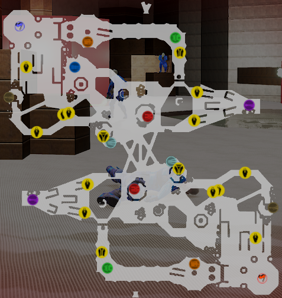

# My Projects

Here, you can find informations about some of my projects and what did I do on them!

***

## Derayah
> Derayah is an **Exploration Puzzle** game where knowledges are essential, made with **Unity 6** in **2024-2025**.

As programming wasn't very challenging on this project, I decided to concentrate on the **Level Design** and **Narrative Design** of this world.

It was our **graduation project**, on which 8 of us worked together for 9 months. I was able to work with all the departments of a video game development team and develop other skills, notably in **Game Design** and playtest feedback.

[Trailer](https://www.youtube.com/watch?v=v5ajwtJz154)  
[A Full Playtrough]() (coming soon)  
[Download the game and have fun!](https://john-gd.itch.io/airavata)

***

## Fish'n'Ship
> Fish'n'Ship is a **Cooperation** game with scuba diving and sailor gameplay, made with **Unity 6** in **C#** in **48 hours** for Global Game Jam 2025.

I took care of all the programming around the boat gameplay side, including **Gameplay Programming**, **U.I. Programming** and other smaller tasks.

We were two programmers, so we split our work on each of the two gameplays. For 2 days, I took care of all the **programming** related to the boat gameplay, the **implementation** of artists' assets, **UI management**, the **minimap** and other stuff developed in [detail](https://github.com/MarinAussant/Portfolio/blob/main/Projects/Fish'n'Ship/Fish'n'Ship.md) link.

[Some Gameplay]() (coming soon)  
[Download the game and have fun!](https://alanoixdecocow.itch.io/fish-n-ship)

***

## Opération Mulberry
> Opération Mulberry is a **Serious Puzzle** mobile game about the Normandy landings in World War II, made with **Unity** in **C#** in **1 month** in **2023**.

We were 3 on this project, and I was responsible for all the **Programming**.

My first group project on Unity, Operation Mulberry is a **mobile game**, and I had to develop the entire **Touch Detection** and **Drag&Drop** system. I also had to **integrate** our artist's 3D assets.

[A Playtrough](https://www.youtube.com/watch?v=7NWKX2iD1_A)  
[Download the game and have fun!](https://john-gd.itch.io/ps3)

***

## Boarding Chaos (Unreal Tournament 4)
> Boarding Chaos is a **Capture The Flag** map made with **Unreal Tournament Editor** in **2 week** in **2023**.

I made the entire map in **blocking**, then used the textures from the base game to **dress it up**, and **managed the placement** of the 2 bases and the various weapons and items.

Boarding Chaos is a Capture The Flag blocking map made for Unreal Tournament 4, featuring **different zones** for the game's various weapons and a wide range of **possible paths**.

[Some Gameplay](https://www.youtube.com/watch?v=7EFZHr2oBxU) 

***

## Dawn on Skyglow
> Dawn on Skyglow is a **2D Platformer** made with **Phaser 3** in **JavaScript** in **1 month** in **2023**.

I designed the entire game, from **Programming** to **Art**, **Level Design** and **Animation**, playable both on the **keyboard** and the **controller**.

I developed simple mechanics to focus on the **Player Controller**, with the implementation of the **State Pattern**, a **Coyote Jump** and a **Jump Buffer**, to achieve a demanding **Level Design** for the player.
 
[A Full Playtrough](https://www.youtube.com/watch?v=lvoJxfqtgMc)   
[Download the game and have fun!](https://marinaussant.itch.io/dawn-on-skyglow)

***

## What The Flag!
> What The Flag! is a **2D Puzzle Platformer** made with **Phaser 3** in **JavaScript** in less than **2 days** in **2023** for ETPA Inter Campus Game Jam 2023.

I was in charge of **Programming** each of the game's mechanics.

Each level was different, and with a **New Mechanic**, I had to learn to code a lot of **different things quickly** and **adapt**.

[A Playtrough](https://youtu.be/XPo3reLPVV8)   
[Download the game and have fun!](https://maerys.itch.io/what-the-flag)

***

## 2D Platformer Controller
> A **2D Platformer Controller** made to learn **Unity** in **C#** in **1 week** in **2022**.

 coming soon

The aim of this small project was to develop a complete **Character Controller** for a **2D platformer**, integrating **Character Animations**, **Acceleration** and **Deceleration**, a **Jump Height Control**, a **Coyotte Jump** and a **Jump Buffer** thanks to **State Pattern** in order to learn the basics of Unity.

I added a simple Ori-inspired mechanic, including a **Time Stop** and **Propulsion** in one direction.

***

## A last word

I hope I've convinced you of my skills in team and solo projects. I'm always interested in new projects that will help me discover new things and improve myself.   

***

- [If you'd like to see my **CV**.](../Documents/AussantMarin(cvTemp).pdf)
- [If you'd like to find out more about my **Skills**.](../Skills/MySkills.md)
- [If you'd like to get to **Know Me Better** (Games, Musics, etc...).](../WhatILike/WhatILike.md)   

[Or return to the **Main Page**.](../README.md)
