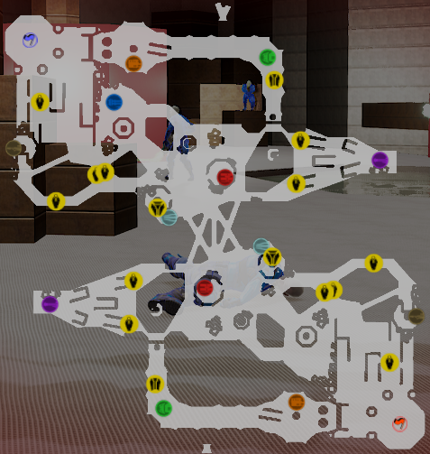

# **My Level Design Skills**

***

- [If you'd like to look at my other **Skills**.](MySkills.md)
- [If you'd like to see my **Resume**.](../Documents/AussantMarin_CV.pdf)
- [If you want to see my different **Projects**.](../Projects/MyProjects.md)
- [If you'd like to get to **Know Me Better** (Games, Musics, etc...).](../WhatILike/WhatILike.md)

[Or return to the **Main Page**.](../README.md)

***

## **Blocking**

***

## **Testing**

***

## **Level Design Project I worked on**

### Derayah
> Derayah is an **Exploration Puzzle** game where knowledges are essential, made with **Unity 6** in **2024-2025**.

As programming wasn't very challenging on this project, I decided to concentrate on the **Level Design** and **Narrative Design** of this world.

It was our **graduation project**, on which 8 of us worked together for 9 months. I was able to work with all the departments of a video game development team and develop other skills, notably in **Game Design** and playtest feedback.

[Trailer](https://www.youtube.com/watch?v=v5ajwtJz154)  
[A Full Playtrough]() (coming soon)  
[Itch.io Page](https://john-gd.itch.io/airavata)

### Boarding Chaos (Unreal Tournament 4)
> Boarding Chaos is a **Capture The Flag** map made with **Unreal Tournament Editor** in **2 week** in **2023**.

I made the entire map in **blocking**, then used the textures from the base game to **dress it up**, and **managed the placement** of the 2 bases and the various weapons and items.

Boarding Chaos is a Capture The Flag blocking map made for Unreal Tournament 4, featuring **different zones** for the game's various weapons and a wide range of **possible paths**.

[Some Gameplay](https://www.youtube.com/watch?v=7EFZHr2oBxU)

### UE5 Blocking Navigation
> This is a project made to learn simple **Blocking** on **UE5** made on **2023**.

The aim of this exercise was to create interesting navigation in a 3D space using Unreal Engine 5.

I was able to guide the player through perspective, lights, viewpoints, create optional paths and a few money shots.

[A Full Playtrough](https://youtu.be/F2MlKlcNazo)

### Dawn on Skyglow
> Dawn on Skyglow is a **2D Platformer** made with **Phaser 3** in **JavaScript** in **1 month** in **2023**.

I designed the entire game, from **Programming** to **Art**, **Level Design** and **Animation**, playable both on the **keyboard** and the **controller**.

I developed simple mechanics to focus on the **Player Controller**, with the implementation of the **State Pattern**, a **Coyote Jump** and a **Jump Buffer**, to achieve a demanding **Level Design** for the player.

[A Full Playtrough](https://www.youtube.com/watch?v=lvoJxfqtgMc)   
[Itch.io Page](https://marinaussant.itch.io/dawn-on-skyglow)

***

- [If you'd like to look at my other **Skills**.](MySkills.md)
- [If you'd like to see my **Resume**.](../Documents/AussantMarin_CV.pdf)
- [If you want to see my different **Projects**.](../Projects/MyProjects.md)
- [If you'd like to get to **Know Me Better** (Games, Musics, etc...).](../WhatILike/WhatILike.md)

[Or return to the **Main Page**.](../README.md)

Don't hesitate to send me a message !

* [My Mail](mailto:marin.aussant@gmail.com)
* [My Linkedin](https://www.linkedin.com/in/marin-aussant-623254229/)
* [My Itch.io](https://marinaussant.itch.io/)

have a good day :)