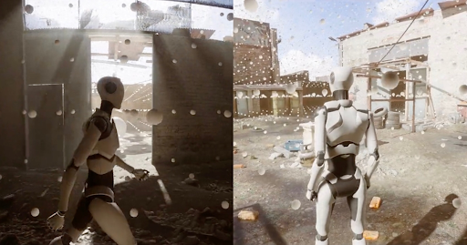

# My Programming Skills

***

## Architecture

Before starting a project, I always think about how I'm going to **structure** it, first in broad outline to make initial prototypes, then in more detail.


To do this, I learned to use the **UML language** during my D.U.T. in **Computer Science**, and I use it for each new project to plan how the different parts of my code will be **organized**.

All this with the aim of **factoring** the code, using **OCP** as much as possible, to promote **maintainability** over time, **adding new features** easily and **without risk**, and working with several **different people** at the same time.


In the same vein, I've got into the habit of using a few **Design Patterns** such as **Inheritance**, **Observer Pattern** for declaring and using events, **State Pattern** for A.I. and Character Behavior, and **Singleton** for easily creating Managers.


In particular, I used the State Pattern in the [**Dawn On Skyglow**](../Projects/Dawn%20on%20Skyglow/DawnOnSkyglow.md), [**Rat Escape!**](../Projects/Other%20Projects/Rat%20Escape%20!/RatEscape!.md) or [**2D Platformer Controller**](../Projects/Other%20Projects/2D%20Platformer%20Controller/2dPlatformerController.md) projects.

I always try to **optimize** my code as much as possible, using the **syntax** and **lexicon** defined by the project, with the aim of maximizing **readability**.

***

## Unity

On Unity, I then mastered the tools provided by the engine, such as **Scriptable Objects**, **Prefab**, **Delegate** and **Event**.

I then specialized in **Gameplay** and **3C Programming**. I create 1st and 3rd person **Character Controllers**, as well as other systems more specific to each project, such as [**Fish'nShip**](../Projects/Fish'n'Ship/Fish'n'Ship.md), [**Rat Escape!**](../Projects/Other%20Projects/Rat%20Escape%20!/RatEscape!.md) or [**Operation Mulberry**](../Projects/Op%C3%A9ration%20Mulberry/Op%C3%A9rationMulberry.md).

//AJOUTER GIF Fish'n Ship ET 2D Platformer Controller OU Rat Escape !

I also do **UI Programming** to make the link with displayed UI and I know how to make it **responsive** so that it is **dynamic** and **pleasant to use**.

//AJOUTER SCREEN DE Fish'n Ship

I've also mastered **Mobile Development** with **Unity Remote**, and can create tools to **detect** and **manage** different **Inputs** and **Swipes** for mobile games like [**Operation Mulberry**](../Projects/Op%C3%A9ration%20Mulberry/Op%C3%A9rationMulberry.md).

//AJOUTER GIF DE Opération Mulberry

I also know how to set up and use optimization tools like **Occlusion Culling** and **LOD Group**, and how to manage lights on Unity 6 with **Adaptive Probe Volume**.




***

## Unreal Engine

oui je maîtrise la prog gameplay et 3c avec le blueprint d'unreal

je sais utiliser et mettre en place des ui avec l'outil d'unreal

j'ai aussi pu faire quelques shader simple

***

## Other

oui phaser le javascript et à l'aise avec les json

oui avec python aussi génération procédural perlin noise 1D

interessé par l'anim procédural

par la génération procédural

par l'IA

par comment améliorer le feeling du joueur, l'ux

d'autres moteurs comme Godot

et par d'autres manière de programmer comme l'ECS

***

- [If you'd like to look at my other **Skills**.](../Skills/MySkills.md)
- [If you'd like to see my **CV**.](../Documents/AussantMarin(cvTemp).pdf)
- [If you want to see my different **Projects**.](../Projects/MyProjects.md)
- [If you'd like to get to **Know Me Better** (Games, Musics, etc...).](../WhatILike/WhatILike.md)

[Or return to the **Main Page**.](../README.md)

**code exemple:**
```C#
public class TestClass : MonoBehaviour
{
    // Exemple Code dans MD
}
```    

