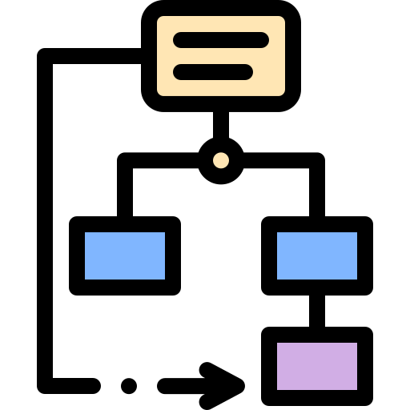

# My Programming Skills

***

- [If you'd like to look at my other **Skills**.](MySkills.md)
- [If you'd like to see my **Resume**.](../Documents/AussantMarin_CV.pdf)
- [If you want to see my different **Projects**.](../Projects/MyProjects.md)
- [If you'd like to get to **Know Me Better** (Games, Musics, etc...) [WIP].]()

[Or return to the **Main Page**.](../README.md)

***

## Unity

On **Unity**, I then mastered the tools provided by the engine, such as **Scriptable Objects**, **Prefab**, **Delegate** and **Event**.

I then specialized in **Gameplay** and **3C Programming**. I create 1st and 3rd person **Character Controllers**, as well as other systems more specific to each project, such as [**Fish'nShip**](https://alanoixdecocow.itch.io/fish-n-ship), **Rat Escape!** or [**Operation Mulberry**](https://john-gd.itch.io/ps3).

I also do **UI Programming** to make the link with displayed UI and I know how to make it **responsive** so that it is **dynamic** and **pleasant to use**.

I've also mastered **Mobile Development** with **Unity Remote**, and can create tools to **detect** and **manage** different **Inputs** and **Swipes** for mobile games like [**Operation Mulberry**](https://john-gd.itch.io/ps3).

I also know how to set up and use optimization tools like **Occlusion Culling** and **LOD Group**, and how to manage lights on Unity 6 with **Adaptive Probe Volume**.

***

## Unreal Engine

On the **Unreal Engine**, I'm able to create simple **Gameplay** and **3C** mechanics using **Blueprint**, and I've mastered the **UI** creation tool using Widgets, linking the Blueprint code with the game.

I'm also interested in **Tech Art**, creating **Shaders** to enhance the visual aspect of the game or to add a unique artistic touch such as a Toon, Pixalate... shaders.

***

## Architecture [WIP]

Before starting a project, I always think about how I'm going to **structure** it, first in broad outline to make initial prototypes, then in more detail.

To do this, I learned to use the **UML language** during my D.U.T. in **Computer Science**, and I use it for each new project to plan how the different parts of my code will be **organized**.

All this with the aim of **factoring** the code, using **OCP** as much as possible, to promote **maintainability** over time, **adding new features** easily and **without risk**, and working with several **different people** at the same time.

In the same vein, I've got into the habit of using a few **Design Patterns** such as **Inheritance**, **Observer Pattern** for declaring and using events, **State Pattern** for A.I. and Character Behavior, and **Singleton** for easily creating Managers.

In particular, I used the State Pattern in the [**Dawn On Skyglow**](../Projects/Dawn%20on%20Skyglow/DawnOnSkyglow.md), **Rat Escape!** or [**2D Platformer Controller**](../Projects/Other%20Projects/2D%20Platformer%20Controller/2dPlatformerController.md) projects.

I always try to **optimize** my code as much as possible, using the **syntax** and **lexicon** defined by the project, with the aim of maximizing **readability**.

***

## Other [WIP]

[comment]: <> (
oui phaser le javascript et à l'aise avec les json
oui avec python aussi génération procédural perlin noise 1D
interessé par l'anim procédural
par la génération procédural
par l'IA
par comment améliorer le feeling du joueur, l'ux
d'autres moteurs comme Godot
et par d'autres manière de programmer comme l'ECS)

***

- [If you'd like to look at my other **Skills**.](MySkills.md)
- [If you'd like to see my **Resume**.](../Documents/AussantMarin_CV.pdf)
- [If you want to see my different **Projects**.](../Projects/MyProjects.md)
- [If you'd like to get to **Know Me Better** (Games, Musics, etc...) [WIP].]()

[Or return to the **Main Page**.](../README.md)

Don't hesitate to send me a message !

* [My Mail](mailto:marin.aussant@gmail.com)
* [My Linkedin](https://www.linkedin.com/in/marin-aussant-623254229/)
* [My Itch.io](https://marinaussant.itch.io/)

have a good day :)